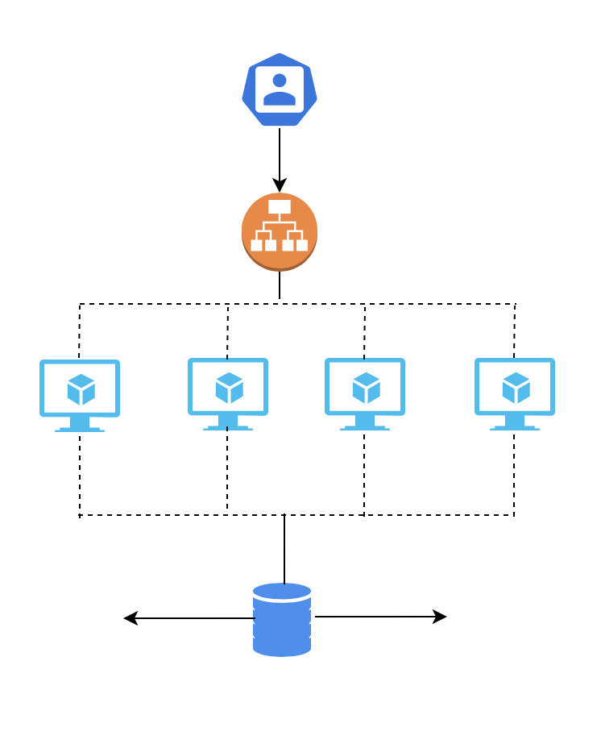
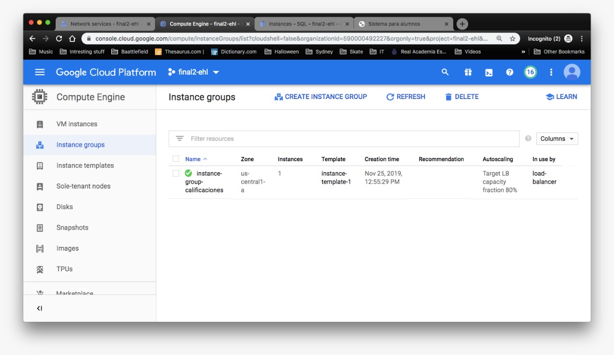
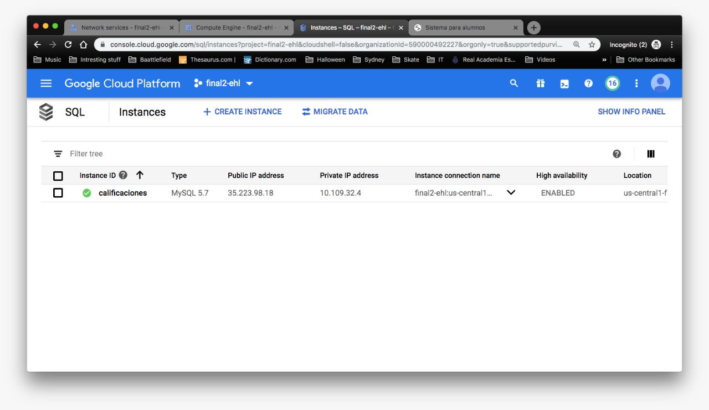
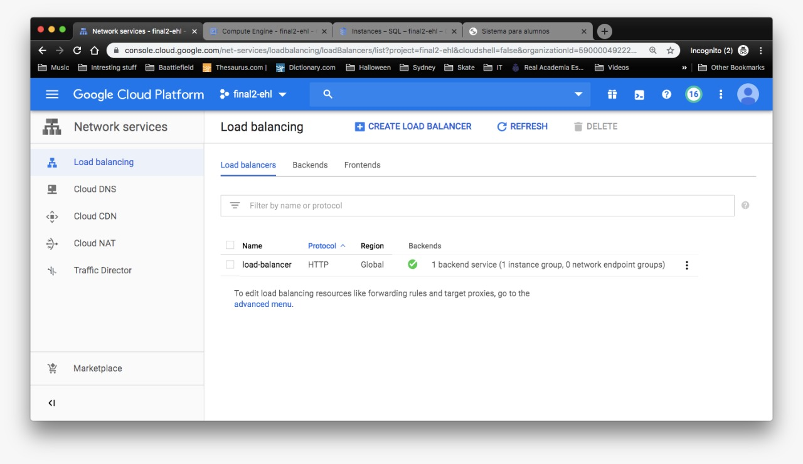

# *Proyecto Final TC3059*
---
#### Materia: *TC3059 Desarrollo de Aplicaciones en la Nube*

##### Campus: *Santa Fe*

##### Integrantes:
1. *Emilio Hernandez Lopez*
2. *Jorge Constanzo De la Vega Carrasco*

---
## 1. Aspectos generales

### 1.1 Requerimientos técnicos

A continuación se mencionan los requerimientos técnicos mínimos del proyecto, favor de tenerlos presente para que cumpla con todos.

* El equipo tiene la libertad de elegir las tecnologías de desarrollo a utilizar en el proyecto, sin embargo, debe tener presente que la solución final se deberá ejecutar en una de las siguientes plataformas en la nube: [Google Cloud Platform](https://cloud.google.com/?hl=es), [Amazon Web Services](https://aws.amazon.com/) o [Microsoft Azure](https://azure.microsoft.com/es-mx/).
* El proyecto deberá utilizar 
* La solución debe utilizar una arquitectura de microservicios. Si no tiene conocimiento sobre este tema, le recomendamos la lectura [*Microservices*](https://martinfowler.com/articles/microservices.html) de [Martin Fowler](https://martinfowler.com).
* La arquitectura debe ser modular, escalable, con redundancia y alta disponibilidad.
* La arquitectura deberá estar separada claramente por capas (*frontend*, *backend*, *API RESTful*, datos y almacenamiento).
* Deberá utilizarse contenedores [Docker](https://www.docker.com/) y un orquestador como [Kubernetes](https://kubernetes.io/).
* La API deberá utilizar autenticación y estar desplegada detrás de un API Manager como [Cloud Endpoints](https://cloud.google.com/endpoints/).
* El proyecto deberá contar con los archivos de configuración y *scripts* necesarios para crear toda la infraestructura necesaria, utilizando alguna solución de *Infraestructure as a Code* como [Deployment Manager](https://cloud.google.com/deployment-manager/).
* Todo el código, *datasets* y la documentación del proyecto debe alojarse en este repositorio de GitHub. Favor de mantener la estructura de carpetas propuesta.

### 1.2 Estructura del repositorio
El proyecto debe seguir la siguiente estructura de carpetas, la cual generamos por usted:
```
- / 			        # Raíz de todo el proyecto
    - README.md			# Archivo con los datos del proyecto (este archivo)
    - frontend			# Carpeta con la solución del frontend (Web app)
    - backend			  # Carpeta con la solución del backend (CMS)
    - api			      # Carpeta con la solución de la API
    - datasets		  # Carpeta con los datasets y recursos utilizados (csv, json, audio, videos, entre otros)
    - dbs			      # Carpeta con los modelos, catálogos y scripts necesarios para generar las bases de datos
    - models			  # Carpeta donde se almacenarán los modelos de Machine Learning ya entrenados
    - docs			    # Carpeta con la documentación del proyecto
```

### 1.3 Documentación  del proyecto

Como parte de la entrega final del proyecto, se debe incluir la siguiente información:

* Descripción del problema a resolver.
* Diagrama con la arquitectura de la solución.
* Descripción de cada uno de los componentes de la arquitectura.
* Justificación de los componentes seleccionados.
* Explicación del flujo de información en la arquitectura.
* Descripción de las fuentes de información utilizadas (archivos CSV, JSON, TXT, bases de datos, entre otras).
* Guía de configuración, instalación y despliegue de la solución en la plataforma en la nube seleccionada.
* Documentación de la API. Puede ver un ejemplo en [Swagger](https://swagger.io/). 
* El código debe estar documentado siguiendo los estándares definidos para el lenguaje de programación seleccionado.

## 2. Descripción del proyecto

Este proyecto trata de simular un sistema de calificaciones de un colegio, donde el profesor ingresa calificaciones y el alumno las recibe y es capaz de ver sus calificaciones computarizadas. Ambos deben ingresar con una cuenta previamente hecha. Además, el maestro debe ser capaz de actualizar las calificaciones de sus alumnos. Este sistema contará con una base de datos de donde se recuperará la información.

## 3. Solución

Para hacer este proyecto se utilizó PHP para incorporar la visualización del sistema. Se levantaron cuatro maquinas virtuales que simulan el sistema conectados a una base de datos mysql. Para que el sistema pueda ser visualizado estará subido en Google Cloud Platform. Las ip's con las que la plataforma se encuentra funcionando son privadas. Además,cuenta con un balanceador de carga hace que las máquinas virtuales funcionen de acuerdo a las peticiones del usuario. La base de datos,realizada con mysql, es escalable. 

### 3.1 Arquitectura de la solución
 

El usuario usa la aplicación que se encuentra en Google Cloud Platform. Se encuentra levantada de forma monolítica. Al usarla, un balanceador de carga se encarga en decidir a que máquina virtual se dirigirá. Al haber elegido una de las dos opciones disponibles, se enviará una petición a la base de datos que tiene todos los datos de los estudiantes y profesores. La base de datos es escalable, por lo tanto, si recibe mayor cantidad de datos, no se romperá y los recibirá. Además, la red en la que se maneja este sistema es privada. 

### 3.2 Descripción de los componentes

* Google Cloud Platform - Plataforma donde se encuentra funcionando la aplicación
* Balanceador de carga - Asigna la petición del usuario (Profesor o Alumno)
* Máquina virtual - Contiene la funcionalidad de la aplicación, se encuentra en la funcionalidad de GCP, Compute Engine. 
* Base de datos, sql server - contiene las tablas con los registros que se obtienen de acuerdo a las peticiones que el usuario haga. 

### 3.3 Proyecto

Este proyecto es muy sencillo ya que consta de archivos php que funcionan para ingresar al registro que el usuario quiera. Cuenta, además, con espacios de texto en los cuales el usuario ingresa la información que desea. Los estilos que se visualiza en los archivos están hechos con css. 

Grupos de Instancias:
 

Instancias: 
 

Balanceador de carga:
 

#### 3.3.1 Lenguaje de programación
El lenguaje utilizado fue php ya que facilita el desarrollo de servicios web al contar con compatibilidad en html.  


